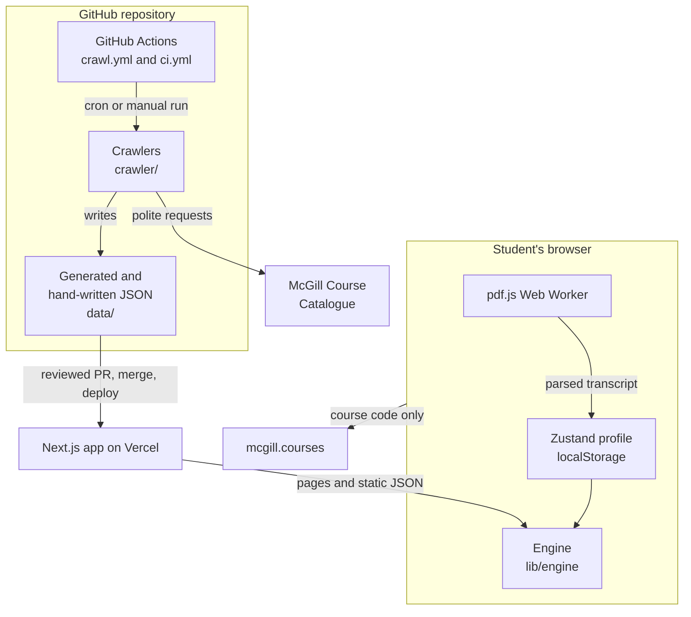
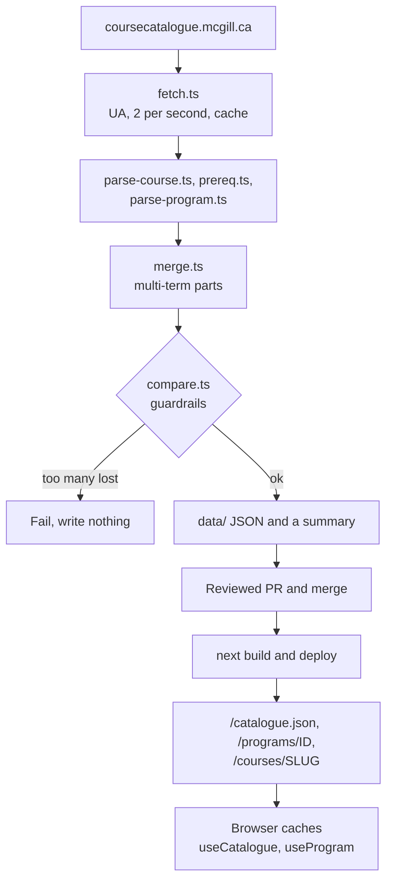
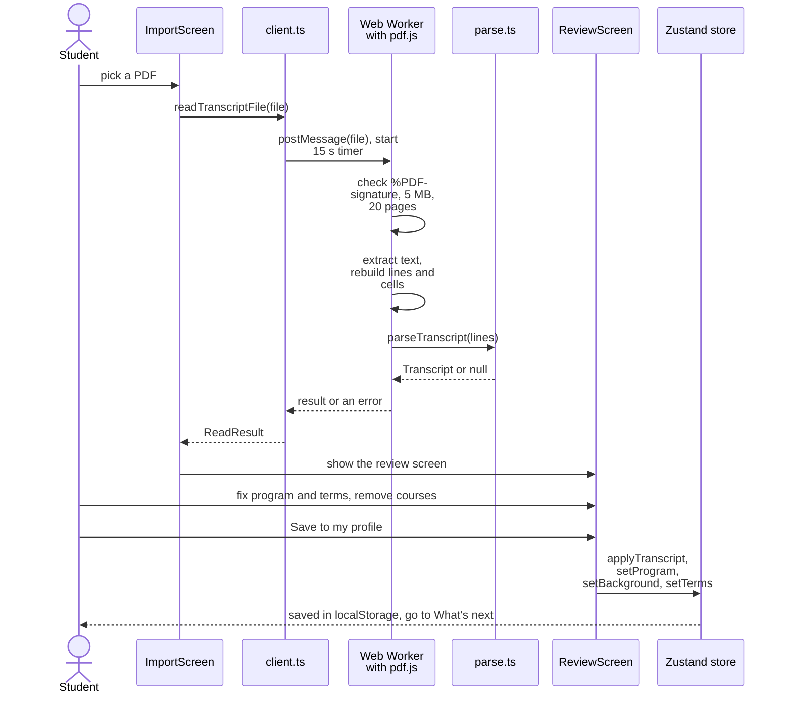

# Architecture

This guide explains how Plan Your Degree is built and how its parts fit together.
Read [PRD.md](PRD.md) for scope and requirements, [README.md](README.md) for setup, and [CONTRIBUTING.md](CONTRIBUTING.md) for the code rules.
Larger diagrams of each flow are in [docs/architecture-diagrams.md](docs/architecture-diagrams.md).

## Overview

Plan Your Degree is an open-source degree planner for McGill students.
A student imports an unofficial Minerva transcript, sees which courses they can take next, and plans every term up to graduation.
Anyone can also browse the whole course catalogue, with or without a profile.

The core constraint is that the MVP has no backend.
The profile lives in the browser's `localStorage`, and nothing about the student is sent anywhere.
The transcript PDF is parsed in the browser by pdf.js inside a Web Worker, and the file is never uploaded or stored.
The only call from app code to another site is the ratings request to mcgill.courses, which carries a course code and nothing else.
Supabase is planned for P1 login and sync only (see [PRD.md](PRD.md)), and no Supabase code exists yet.

| Folder | What lives there |
|---|---|
| [crawler/](crawler/) | Scripts that read the McGill catalogue and write JSON. They run on Node and never ship in the app. |
| [data/](data/) | The generated catalogue and programs, plus the five hand-written programs. |
| [app/](app/) | Next.js routes: pages, `/catalogue.json`, `/programs.json` and `/programs/[id]`. |
| [components/](components/) | React components. `ui/` holds the primitives and the rest is grouped by feature. |
| [lib/catalogue/](lib/catalogue/), [lib/programs/](lib/programs/) | Types, server-side loading, browser hooks and search for courses and programs. |
| [lib/profile/](lib/profile/), [lib/transcript/](lib/transcript/) | The profile store and file format, and the PDF reader, parser and synthetic fixtures. |
| [lib/engine/](lib/engine/) | Pure functions that turn a profile and the catalogue into statuses, progress, suggestions and warnings. |
| [e2e/](e2e/) | Playwright tests. |

## Data sources

### coursecatalogue.mcgill.ca

This is the only source of course and program data.
The `/courses/` index lists every course page, and each page holds the title, credits, terms offered, description, prerequisites, corequisites and restrictions.
`/sitemap.xml` lists every program page under `/en/undergraduate/<faculty>/programs/`, and each page holds the requirement tables.
Only the current catalogue year can be read, because `robots.txt` disallows `/archive/`.
The crawler reads the year from the text "YYYY-YYYY Undergraduate Catalogue" on the page and stores it with the data.

### The polite crawler rules

All requests go through [crawler/fetch.ts](crawler/fetch.ts).

- **User-Agent:** `Mozilla/5.0 (compatible; McGillPlanYourDegreeBot/0.1; +https://github.com/CBC-Mcgill/McGill-Plan-Your-Degree)`.
  The site sits behind an AWS WAF that answers generic User-Agents with an HTTP 202 challenge page.
  A bot User-Agent in this standard format gets the real page and says who is asking.
- **Rate:** at most 2 requests per second, one every 500 ms.
- **Retries:** anything other than HTTP 200 or 404 is retried up to 5 attempts, waiting 2, 4, 8 and 16 seconds between them.
  A 404 is skipped.
- **robots.txt:** [crawler/robots.ts](crawler/robots.ts) reads the `Disallow` lines for `User-agent: *`.
  Both crawlers check every path first, and a disallowed path stops the run with an error.
- **Cache:** each page is saved in `.cache/catalogue/` (git-ignored) and reused for 24 hours, so an interrupted run resumes without repeating requests.

### mcgill.courses public API

Course pages show student ratings from `https://mcgill.courses/api/courses/<CODE>`.
The fetch runs in the browser from [components/course-ratings.tsx](components/course-ratings.tsx).
It sends no cookies and no referrer, and times out after 5 seconds.
The response also carries the reviews, but the app reads only `avgRating`, `avgDifficulty` and `reviewCount`, so review text is never kept or shown.
The card links to mcgill.courses to read the reviews, and if the request fails it shows only that link.

### Student transcripts

A student prints their unofficial Minerva transcript to PDF and picks the file on the import screen.
It is read locally, as described in [Transcript import](#transcript-import), and is the only student data source.

## The course crawler

`pnpm crawl` runs [crawler/crawl.ts](crawler/crawl.ts) with `node crawler/crawl.ts`.
Node 24 strips the TypeScript types itself, so there is no build step, and that is why crawler imports end in `.ts`.
The crawler imports types and helpers from `lib/`, so it and the app share the data shape in [lib/catalogue/types.ts](lib/catalogue/types.ts).

**Discovery and parsing.**
[crawler/discover.ts](crawler/discover.ts) lists every `/courses/<subject>-<number>` link on the index, sorted and deduplicated.
[crawler/parse-course.ts](crawler/parse-course.ts) reads each page with cheerio.
It takes the code and title from the heading, and credits, offering unit, faculty and terms from the labelled detail fields.
The note list holds prerequisites, corequisites and restrictions, which the parser tells apart by label, including the odd spellings found in real pages.
Anything left over goes into `notes`.

**Prerequisites become AND/OR trees.**
[crawler/prereq.ts](crawler/prereq.ts) turns the text into a `RequirementTree`, where a leaf is a course code and a group is `{ and: [...] }` or `{ or: [...] }`.
For example, `COMP 250; MATH 235 or MATH 240` becomes `COMP 250 AND (MATH 235 OR MATH 240)`.
It splits the text into tokens (codes, `and`, `or`, commas, brackets, "one of") and a small parser builds the tree, including shortened lists such as "MATH 222 or 223".
The raw text is always kept in `text`.
A requirement is marked `unparsed` when it has words that are not codes, such as "permission of the instructor", or when the parser meets a mix it cannot read with confidence.
The UI then shows the raw text and a "has conditions" flag instead of trusting the tree.
Restrictions are read the same way, and "not open to students who have taken" lists become `excludes`.

**Multi-term courses become one course.**
The catalogue has a separate page for each part of a course that spans terms, such as ECSE 458D1 and ECSE 458D2.
[crawler/merge.ts](crawler/merge.ts) groups pages whose code ends in `D1`, `D2`, `N1`, `N2` or `J1` to `J3` into one logical course such as ECSE 458.
The merged course keeps a `parts` list with each part's code, credits and terms.
Credits add up along one route, and the larger route total wins.
Requirements elsewhere that name a part are renamed to the logical code.

**Guardrails and the comparison summary.**
[crawler/compare.ts](crawler/compare.ts) compares the new crawl with the committed data.
The run fails before writing anything when the course count drops more than 2%, or when more than 1% of courses lose a title, credits, offering unit or description.
Otherwise it builds a Markdown summary of added, removed and changed course codes, plus how many prerequisites show as raw text only.
Setting `CRAWL_SUMMARY_FILE` saves the summary to that path, which is how the workflow reuses it.

**Output.**
Courses are sorted by code and written to `data/catalogue/courses/<SUBJECT>.json`, one file per subject.
[data/catalogue/meta.json](data/catalogue/meta.json) records the catalogue year, source, course count and subjects.
The output is deterministic, so a rerun against an unchanged site gives a zero diff.

## The program crawler

`pnpm crawl:programs` runs [crawler/crawl-programs.ts](crawler/crawl-programs.ts).
It reads `data/catalogue/` to map a department name to its subject code and to report course codes the catalogue lacks, so run the course crawl first.

1. [crawler/discover-programs.ts](crawler/discover-programs.ts) reads the sitemap and keeps program pages.
   It drops index pages that only link to deeper pages, and when a program appears under two faculty paths it keeps the faculty's own page.
2. [crawler/parse-program.ts](crawler/parse-program.ts) turns each page into the `Program` schema in [lib/programs/types.ts](lib/programs/types.ts).
   A page with no requirements, such as a department index, is skipped.
3. Every program must pass `validateProgram` in [lib/programs/validate.ts](lib/programs/validate.ts), and all must agree on one catalogue year, or the run fails.
4. A guardrail fails the run if the program count drops more than 5% against the previous crawl's `index.json`, from the same year's folder or else the newest earlier year.

The parser reads the Courses tab as headings, paragraphs, tables and footnotes, then builds groups.

| Schema piece | Where it comes from |
|---|---|
| Required group | A section where every course is needed. The credits come from the heading. |
| `oneOf` alternative | An "or" row in a table or a footnote such as "MATH 340 or MATH 350". Any one course satisfies the item. |
| Complementary group | A section where the student chooses. Its sentences become rules with `minCredits`, `maxCredits`, `minCourses` and `maxCourses`. |
| Rule selection | A rule lists `courses`, or a `match` on subjects and levels, such as "300 level or above except COMP 396". It can also only filter, such as "at least 6 credits at the 400 level". |
| `unparsed` rule | A sentence with a constraint the parser cannot express safely. It keeps the catalogue text in `title`, matches no course and counts nothing. |
| `foundation` group | A group whose title mentions Year 0 or Foundation, which Quebec CEGEP students are credited for. |

Each program is written to `data/programs/generated/<catalogue year>/<id>.json`, where the id is the last part of the page URL.
An `index.json` beside them lists each program's name, degree, faculty, credits and number of unparsed rules.
The crawler rewrites only the folder for the current year and leaves earlier years alone.
The site no longer serves an old year, so that folder is the only record of it, and a future "entered under an older catalogue year" feature (not handled today, see the PRD) would read it.

The five hand-written programs in `data/programs/*.json` are the quality benchmark.
After each crawl, [crawler/compare-programs.ts](crawler/compare-programs.ts) compares the generated version of each one with the hand-written file and lists every difference in the summary.
The summary also reports the most common unparsed sentences, programs whose groups do not add up to the program credits, and course codes with no catalogue page.
These lines inform the reviewer, and the comparison does not fail the run.
A test in [crawler/programs.test.ts](crawler/programs.test.ts) checks that every course in the generated copies of the five programs exists in the catalogue.
When the app loads programs, a hand-written file replaces the generated one with the same id, see [Program data](#program-data).

## How the scraper is triggered

[.github/workflows/crawl.yml](.github/workflows/crawl.yml) is the "Crawl catalogue" workflow.
It starts in two ways.

- **On a schedule.** The cron lines run at 09:00 UTC (early morning in Montreal) on four days a year.
  `0 9 15 3,4 *` is 15 March and 15 April, and `0 9 1 8,12 *` is 1 August and 1 December.
  A comment in the file says these dates fall before Fall and Winter registration opens and before each add/drop period.
  GitHub runs scheduled workflows only from the default branch.
- **By hand.** Open the Actions tab on GitHub, pick "Crawl catalogue", choose Run workflow, select `main` and confirm.
  The workflow takes no inputs.
  `gh workflow run "Crawl catalogue"` does the same from a terminal.

Only one crawl runs at a time, and a job stops after 240 minutes.
A full crawl takes about 90 minutes.
The job runs these steps on `ubuntu-latest`.

1. Check out the repository, set up pnpm and Node from [.nvmrc](.nvmrc), and run `pnpm install --frozen-lockfile`.
2. Run `pnpm crawl`, then `pnpm crawl:programs`, each saving a summary file, and add both summaries to the run summary page.
3. If `git status` shows no change under `data/catalogue` or `data/programs/generated`, stop.
4. Otherwise create the branch `data/crawl-<date>-<run id>`, commit as `github-actions[bot]` and push.
5. Try `gh pr create` with the summary as the PR body.
   The CBC-Mcgill organization blocks Actions from opening PRs, so on failure the job writes a one-click compare link to the run summary and to an annotation, and you open the PR from it.

Data reaches production only through a reviewed PR.
The reviewer reads the added, removed and changed courses and the program summary, then merges.
Never hand-edit files in `data/catalogue/` or `data/programs/generated/`, because the next crawl overwrites them.
To fix wrong data, fix the parser and regenerate, as [CONTRIBUTING.md](CONTRIBUTING.md) describes.

To run the crawlers locally, run `pnpm crawl` and then `pnpm crawl:programs`.
A full course crawl takes about 90 minutes and resumes from `.cache/catalogue/` if you stop it.
Both commands rewrite files under `data/`, and `git diff` shows what changed.

## The web app

The app is Next.js 16 with the App Router and the React Compiler, turned on in [next.config.ts](next.config.ts).
Styling is Tailwind CSS v4, loaded through the Turbopack rule in the same file.
`pnpm typecheck` runs `next typegen` first, which generates the route types such as `PageProps` and `RouteContext`.

### Routes

| Route | File | What renders where |
|---|---|---|
| `/` | [app/page.tsx](app/page.tsx) | A server page holding the client `Home`: a landing page for visitors and a dashboard for students with a profile. |
| `/courses` | [app/courses/page.tsx](app/courses/page.tsx) | A server page holding the client `CourseBrowser`, which keeps its whole query in the URL. |
| `/courses/[slug]` | [app/courses/[slug]/page.tsx](app/courses/[slug]/page.tsx) | A server component. The text, requirements and unlock list are the same for everyone, and the student-specific parts are client components. |
| `/next`, `/requirements`, `/plan`, `/profile` | [app/next/](app/next/page.tsx), [app/requirements/](app/requirements/page.tsx), [app/plan/](app/plan/page.tsx), [app/profile/](app/profile/page.tsx) | Server pages holding the client `WhatsNext`, `Requirements`, `Planner` and `ProfileView` (which hosts the import flow). |
| `/advisor` | [app/advisor/page.tsx](app/advisor/page.tsx) | A preview of the future AI advisor. It calls no AI. |
| `/catalogue.json`, `/programs.json`, `/programs/[id]` | [app/catalogue.json/](app/catalogue.json/route.ts), [app/programs.json/](app/programs.json/route.ts), [app/programs/[id]/](app/programs/[id]/route.ts) | Static route handlers, described below. |

The server cannot know the student, so profile-dependent screens render a skeleton until the profile has loaded from `localStorage` (`useProfileHydrated`).
[app/layout.tsx](app/layout.tsx) mounts the shared client pieces: the header, the storage warning banner, the command palette and the toaster.

### The catalogue download

[lib/catalogue/server.ts](lib/catalogue/server.ts) reads `data/catalogue/courses/*.json` once per process into a map keyed by course code, and builds the reverse prerequisite index behind each course's "Unlocks" list.
[app/catalogue.json/route.ts](app/catalogue.json/route.ts) is `force-static`, so at build time it writes every course without `description` and `notes` (the `CourseSummary` type).
[lib/catalogue/client.ts](lib/catalogue/client.ts) fetches `/catalogue.json` once per page load into a module-level store read with `useSyncExternalStore`.
The state is `loading` on the server and during hydration, then `ready` or `error`, and `retryCatalogue` asks again after a failure.
The download starts the first time a component asks for the catalogue, so the landing page and the empty planner do not fetch it.
Search runs in the browser, and [lib/catalogue/search.ts](lib/catalogue/search.ts) ranks matches from exact code down to loose title matches.

### Course pages

`generateStaticParams` in the course page returns an empty list, so nothing is built ahead.
Each course renders on its first visit and is then served from the static cache.
The page reads the full course from the server loader and draws the description, notes, requirements and unlocks.
Prerequisites come from the tree with each code as a link, unless the requirement is `unparsed`, in which case the raw text shows.
The server passes only the fields a status needs (`toStatusInput`) to client components such as `CourseStatusPanel`, which compute the student's status in the browser.
`AddToPlan` and `CourseRatings` are client components too.
`AddToPlan` is a split button: the main part plans the course for the next term it runs, and its menu lists every term from the next term to plan through graduation, with the credits each already holds.

### Program data

Program data reaches the browser one program at a time.

- At build time, [lib/programs/server.ts](lib/programs/server.ts) reads the newest `data/programs/generated/<year>/` folder, then every hand-written `data/programs/*.json`.
  A hand-written file replaces the generated one with the same id.
- [app/programs.json/route.ts](app/programs.json/route.ts) is static and lists the id, name, degree and faculty of every program.
- [app/programs/[id]/route.ts](app/programs/[id]/route.ts) is static, with `generateStaticParams` over every id and `dynamicParams` off, and serves one full `Program`.
- [lib/programs/client.ts](lib/programs/client.ts) holds a module cache.
  `useProgramIndex` fetches `/programs.json` the first time a component asks, and `useProgram(id)` fetches `/programs/<id>` once.
  `useProgram` returns `undefined` while loading and `null` for an empty id, an unknown id or a failed fetch.
- The course browser, What's next, Requirements, the home dashboard, the planner and the profile call `useProgram`.
  The program picker and the import review call `useProgramIndex`.
- [lib/programs/index.ts](lib/programs/index.ts) still covers only the five hand-written programs, in `PROGRAMS` and `getProgram`.
  Code that cannot wait for a fetch uses it, such as the profile migration in [lib/profile/file.ts](lib/profile/file.ts) and the schema test.
- `guessProgram` pre-fills the program after an import.
  It matches the five hand-written programs by exact transcript line, then falls back to the program list by degree and a normalized name, and it answers only when exactly one program fits.
- [components/profile/program-combobox.tsx](components/profile/program-combobox.tsx) is a searchable picker over name, degree and faculty, with a last choice "My program isn't listed".
  [components/generated-banner.tsx](components/generated-banner.tsx) tells the student that a crawled program was read automatically.
  A rule marked `unparsed` shows as a "Check this requirement" row in What's next and the planner, and the engine never counts it as satisfied.

### The design system

- **Primitives:** [components/ui/](components/ui/) holds `Button`, `Card`, `Badge`, `Banner`, `Chip`, `TextField`, `SelectField`, `ViewTabs`, `SegmentedControl`, `ProgressBar`, `Kbd`, `FileButton`, `Tooltip` and `InfoTip`.
  They are shadcn-style, built on Radix and `class-variance-authority`.
- **Tokens:** colors are CSS variables in [app/globals.css](app/globals.css).
  Status colors stay in the navy and blue family, so red keeps meaning "act here".
- **Tooltips:** one `TooltipProvider` in [app/layout.tsx](app/layout.tsx) sets the delay.
  `InfoTip` is the "i" button beside a label that defines a term, and every definition lives in [lib/glossary.ts](lib/glossary.ts) so the wording stays consistent.
  Anything a student must know to act stays visible on the page, and a tooltip only adds to it.
- **Status glyphs:** [components/status.tsx](components/status.tsx) holds the `STATUS` table of labels, colors and tones, with `StatusIcon`, `StatusLabel`, `StatusBadge` and `UncertainFlag` for requirements with conditions.
- **Toasts with undo:** [components/toast.tsx](components/toast.tsx) shows one toast at a time for five seconds.
  A toast can carry an Undo action, and Cmd+Z or Ctrl+Z runs it unless the student is typing in a field.
  [components/plan/add-with-undo.ts](components/plan/add-with-undo.ts) uses it for plan changes.
- **Command palette:** [components/command-palette.tsx](components/command-palette.tsx) opens with Cmd+K or Ctrl+K, searches pages and courses, and can add a course to a term.
- **Motion:** animations sit under `MotionConfig reducedMotion="user"` in the layout, so reduced-motion settings are respected.

## Client state

[lib/profile/store.ts](lib/profile/store.ts) is a Zustand store with the `persist` middleware.
It saves to `localStorage` under the key `plan-your-degree:profile`.
Its storage wrapper survives a browser that blocks or fills storage: the profile stays in memory, `useSaveStatus` reports the failure, and [components/storage-banner.tsx](components/storage-banner.tsx) tells the student to export a backup.
The `storage` event keeps tabs in sync, so an edit or a reset in one tab rehydrates the others.

The profile holds:

- **records:** one `CourseRecord` per transcript line or manual entry, with the logical code, an optional part such as `D1`, term, credits, grade, status and source.
  Statuses are `completed`, `in-progress`, `failed`, `withdrawn`, `deferred`, `transfer` and `exemption`.
- **program and background:** `programId`, an optional `minorId` (its progress is counted on its own from the same courses, so a course can count for both), the entry route (`cegep` or `foundation`), advanced standing credits and credits required.
- **terms and plan:** the start term, the graduation term, a credit limit per term (17 by default) and the plan.
- **importedAt:** the time of the last transcript import.

**The plan model.**
A plan is a list of `{ term, courses }` entries sorted by term, and a course sits in one term at most.
A course is stored in the term it starts in, so a multi-term course such as ECSE 458 appears once, in its start term, and the engine expands it into one load per part.
Adding a course that is already planned moves it.

**The versioned file.**
[lib/profile/file.ts](lib/profile/file.ts) defines `PROFILE_VERSION`, currently 3, and the backup file format.
`migrateProfile` brings older data up to the current shape with one step per version, for saved data and for imported files alike.
"Export a backup" on the profile page saves `{ format, version, profile }` as a JSON file.
`parseProfileFile` treats a restored file as untrusted: it limits the size and list lengths, rejects unknown fields, checks every value and refuses a file saved by a newer version.
Restoring runs in [components/profile/use-import-flow.ts](components/profile/use-import-flow.ts) and calls `loadProfile`.
`reset` deletes everything, including the saved copy.

## The engine

[lib/engine/](lib/engine/) is plain TypeScript with no React and no I/O.
Functions take the catalogue, a snapshot and a program as arguments and return data, so they are easy to test, and one test checks that statuses for 10,000 courses take under 100 ms.

- **[snapshot.ts](lib/engine/snapshot.ts)** indexes what the student has done, is doing and has planned.
  `buildSnapshot` turns the records into `done`, `earned` credits, `inProgress`, `planned`, `taken` (done plus in progress) and `pending` multi-term courses.
  For a CEGEP entry it adds the Science DEC equivalents (such as MATH 133 and PHYS 131) to `done` and to `covered`, so they meet prerequisites but earn no McGill credit.
- **[parts.ts](lib/engine/parts.ts)** understands multi-term courses.
  `settleParts` counts a course as done only when every part of one route is done, and finds the part still owed and the term it belongs in.
  `partRoutes`, `routesText` and `creditsLabel` describe routes and credits for the UI.
- **[status.ts](lib/engine/status.ts)** gives the status used by browse and course pages.
  `courseStatus` returns `covered`, `completed`, `in-progress`, `planned`, `available` or `locked`, plus an `uncertain` flag and any restriction that blocks the course.
  `meets` checks a requirement tree against a set of codes, and `isOffered` matches by season because the catalogue lists only the current year's terms.
- **[progress.ts](lib/engine/progress.ts)** allocates the student's courses to program requirements.
  `programProgress` fills required groups first, credits foundation groups for a CEGEP entry, then fills complementary groups in file order.
  A course counts toward one group only and rule caps are respected.
  Each group and rule lists the courses it claimed with their credits, and `unclaimed` holds the counted courses no group took.
  An exemption satisfies a required course but adds no credit, and an `unparsed` rule is never satisfied, so its group never is either.
- **[next.ts](lib/engine/next.ts) and [next-view.ts](lib/engine/next-view.ts)** build What's next for one term.
  `whatsNext` lists the courses the student can take that term as required, on an open complementary list, or other.
  `nextView` shapes that for the page: "must take now", "required later" with the reason each is blocked, complementary groups with progress such as "3 of 6 credits" and the rules to check, and a short list of electives.
- **[plan.ts](lib/engine/plan.ts)** works on the plan.
  `planLoads` turns each planned course into loads, one per term it occupies.
  `schoolTerms` and `termChoices` list the terms a course can start in, from the next term to plan through graduation, for the course page menu.
  `planWarnings` returns non-blocking warnings for a missing prerequisite or corequisite, a term the course is not offered, a restriction, a credit overload, a course that ends after graduation and a missing second part.
- **[stages.ts](lib/engine/stages.ts)** builds the planner's term path.
  `buildStages` returns one stage per Fall and Winter term from the start term to graduation, plus any other term that holds saved data.
  A stage is `completed`, `current`, `past`, `planned` or `empty`, and carries its records, loads, credits and warnings.
  `suggestForTerm` proposes required courses for a term.
- **[credits.ts](lib/engine/credits.ts)** counts earned and pending credits, decides how many credits the degree needs (a stated number, else the program's credits for a B.Eng., else 90 or 120 for a B.Sc. by entry route) and lists exemptions whose credits must be replaced.
- **[browse.ts](lib/engine/browse.ts)** powers the course table: filters, the views "All", "Can take now", "In my program", "Planned" and "Completed", sorting, the URL query format and the one-line explanation of a status.

**How pages call it.**
[lib/profile/use-snapshot.ts](lib/profile/use-snapshot.ts) builds the snapshot once per change to the records, the plan or the entry.
It returns `undefined` while the profile loads and `null` when the student has not started one.
Pages combine it with `useCatalogue` and `useProgram`.
The course browser and command palette call `courseStatus`, What's next calls `nextView`, Requirements and the planner call `programProgress`, and the planner also calls `planWarnings` and `buildStages`.
The client runtime diagram in [docs/architecture-diagrams.md](docs/architecture-diagrams.md) shows which screen calls what.

**An example: ECSE 458.**
ECSE 458 is a 6-credit capstone.
The crawler merges its pages into one course with four parts: D1 and D2 form one route and N1 and N2 form another, each part worth 3 credits.
D1 runs in Fall and D2 in Winter, and the N route is the other way around.
If a student's records hold ECSE 458D1 as done and no D2, `settleParts` sees one of two parts done.
So `buildSnapshot` marks ECSE 458 as in progress and pending without counting the 3 credits, the page says "Credit when ECSE 458D2 is done", and the planner raises a missing-part warning for the term the second part belongs in, unless the course is already planned.
If the student plans ECSE 458 in Fall 2026, the plan stores one entry under Fall 2026.
`planLoads` picks the route whose first part runs in Fall and returns ECSE 458D1 in Fall 2026 and ECSE 458D2 in Winter 2027, each with 3 credits.
The credit limit counts each part in its own term.

## Transcript import

The import code is in [lib/transcript/](lib/transcript/).
The privacy rule is simple: the PDF is read in a Web Worker on the student's device and goes nowhere else.
The parser skips the identity header (name, McGill ID, permanent code, email) and any holds, so they never reach the profile.

**The reader.**
[lib/transcript/client.ts](lib/transcript/client.ts) starts a module Web Worker from [lib/transcript/worker.ts](lib/transcript/worker.ts) and gives it the file.
After 15 seconds without an answer, the client terminates the worker and reports a timeout.
The worker reads at most 5 MB plus one byte and calls `readTranscript` in [lib/transcript/index.ts](lib/transcript/index.ts).
That function rejects a file that does not start with `%PDF-`, is over 5 MB or has more than 20 pages.
It extracts text only, with XFA, font loading, system fonts and WebAssembly turned off, and pdf.js runs inside the same worker, so a malformed PDF cannot freeze the page.
Each failure has its own message in [lib/transcript/result.ts](lib/transcript/result.ts).
`readLines` sorts pdf.js text items into visual lines by position and splits each line into cells at wide gaps, so a table row becomes an array of cells.

**The Minerva layout.**
[lib/transcript/parse.ts](lib/transcript/parse.ts) reads those lines.

- A file counts as a McGill unofficial transcript only if at least two of three markers appear: the title "UNOFFICIAL Transcript", the form name `SWFTRAN` and the footer URL on `horizon.mcgill.ca`.
- It strips the browser's repeating page header and footer, so term blocks that break across pages join up.
- Each term heading such as "Fall 2025" opens a block that begins with the degree, then the program and minor lines.
- A course row has the code, section, title and credits, then grade, remarks, earned credits and class average once graded.
  Courses are matched by code only, because titles are abbreviated.
- Registration codes such as `RW` mark a registered course with no grade, and grades map to `completed`, `failed`, `withdrawn`, `deferred` or `in-progress`.
  A `²` mark or a part suffix such as D1 marks a multi-term course.
- "Credits Required for ... - 90 credits" gives the credits required.
  The line under "PREVIOUS EDUCATION" is saved, and a Quebec CEGEP there sets the CEGEP entry route.
- The "Credits/Exemptions" section holds advanced standing.
  Each "From: ... - N credits" block counts as its total minus the transfer rows listed under it, so nothing counts twice.
  Listed rows with credits become `transfer`, and an `EXC` mark becomes `exemption` with no credit.
- A line that looks like a course but does not parse goes into `unrecognized`.

**The review screen.**
[components/profile/review-screen.tsx](components/profile/review-screen.tsx) shows the result, and nothing is saved until the student chooses "Save to my profile".
The student can fix the detected program, entry route, advanced standing, credits required and terms, and remove any course with an Undo.
Courses missing from the catalogue are flagged, and unrecognized lines are listed so the student can add those courses by hand later.
Saving calls `applyTranscript` and the other store setters, then goes to What's next.
The PDF itself is never stored.

## Testing, CI and deployment

**Unit tests.**
Vitest runs the `*.test.ts` files that sit next to the code, one per module area.
Crawler tests use saved real HTML pages in [crawler/fixtures/](crawler/fixtures/) and real prerequisite strings.
Transcript tests use synthetic fixtures.
[lib/transcript/fixtures/generate.mts](lib/transcript/fixtures/generate.mts) renders fake Minerva transcripts to PDF with Chromium and writes the expected parse result for each.
The fixtures use invented names, IDs and grades, and real transcripts never enter the repo.
Each expected file has a `mustNotContain` list of the fake identity strings, and [lib/transcript/transcript.test.ts](lib/transcript/transcript.test.ts) fails if one shows up in the output.

**End-to-end tests.**
Playwright runs `e2e/*.e2e.ts` in two projects: `desktop` (Desktop Chrome, 1280 px wide) and `small-desktop` (1024 by 768).
[playwright.config.ts](playwright.config.ts) starts `pnpm dev` locally and `pnpm start` in CI, which needs a build first.
The tests load the synthetic PDFs through the real file input, so they walk the same path a student does.
Traces are kept when a test fails.

**CI.**
[.github/workflows/ci.yml](.github/workflows/ci.yml) runs on every pull request and every push to `main`.
It installs with a frozen lockfile, then runs `biome ci`, `pnpm typecheck`, `pnpm test`, `pnpm build`, installs Chromium and runs `pnpm test:e2e`.
On failure it uploads the Playwright traces for 7 days.
Dependabot opens weekly updates for npm packages and GitHub Actions.
Run `pnpm lint && pnpm typecheck && pnpm test && pnpm build && pnpm test:e2e` before a PR for the same result locally.

**Deployment.**
The app is hosted on Vercel, and the repository has no `vercel.json` and needs no environment variables.
GitHub is not connected to Vercel yet, so deploys are manual: from a clean `main`, run `pnpm dlx vercel@latest deploy --prod --yes`.
The build reads `data/` and bakes the catalogue and programs into static JSON, so new data goes live only after the data PR is merged and a deploy runs.
Right after a deploy, the live alias can serve the previous HTML and stylesheet for a few minutes.
Before calling a deploy done, fetch the live page, find its `/_next/static/` stylesheet, and check that it contains a token you changed.
[.vercelignore](.vercelignore) keeps local agent worktrees under `.claude/worktrees/` and caches out of the upload, because the CLI would otherwise send every worktree and Tailwind would pick up classes from other branches.
If the live stylesheet still looks stale after a few minutes, redeploy with `--force` to skip the build cache.

## Where to change things

| To do this | Change this |
|---|---|
| Add a hand-written program | Copy a file in `data/programs/`, import it in [lib/programs/index.ts](lib/programs/index.ts), add it to `PROGRAMS` and the `guessProgram` list, then run `pnpm test`. It overrides the crawled program with the same id. |
| Fix a prerequisite parse | [crawler/prereq.ts](crawler/prereq.ts), with the real string added to [crawler/prereq.test.ts](crawler/prereq.test.ts), then `pnpm crawl`. |
| Fix a program the crawler read wrongly | A hand-written file with the same id, or [crawler/parse-program.ts](crawler/parse-program.ts) with a test in [crawler/programs.test.ts](crawler/programs.test.ts). |
| Change what the crawler reads from a course page | [crawler/parse-course.ts](crawler/parse-course.ts) and [lib/catalogue/types.ts](lib/catalogue/types.ts). |
| Change crawl rate, cache or User-Agent | [crawler/fetch.ts](crawler/fetch.ts). |
| Change the crawl guardrails | [crawler/compare.ts](crawler/compare.ts) and [crawler/compare-programs.ts](crawler/compare-programs.ts). |
| Change the crawl schedule | The `cron` lines in [.github/workflows/crawl.yml](.github/workflows/crawl.yml). |
| Change the wording of a tooltip definition | [lib/glossary.ts](lib/glossary.ts). |
| Change a status label or color | `STATUS` in [components/status.tsx](components/status.tsx) and the color tokens in [app/globals.css](app/globals.css). |
| Change when a course is available, or how requirements count | [lib/engine/status.ts](lib/engine/status.ts) and [lib/engine/progress.ts](lib/engine/progress.ts). |
| Change a plan warning | [lib/engine/plan.ts](lib/engine/plan.ts), shown by [components/plan/term-warnings.tsx](components/plan/term-warnings.tsx). |
| Support a new transcript layout | [lib/transcript/parse.ts](lib/transcript/parse.ts), plus a synthetic case in [generate.mts](lib/transcript/fixtures/generate.mts). |
| Add a field to the profile | [lib/profile/types.ts](lib/profile/types.ts), the store, then the validator and export in [lib/profile/file.ts](lib/profile/file.ts), raising `PROFILE_VERSION` with a migration step. |
| Add a page | A new `app/<route>/page.tsx` holding a client component, a link in [components/nav-links.tsx](components/nav-links.tsx) and an entry in `PAGES` in [components/command-palette.tsx](components/command-palette.tsx). |
