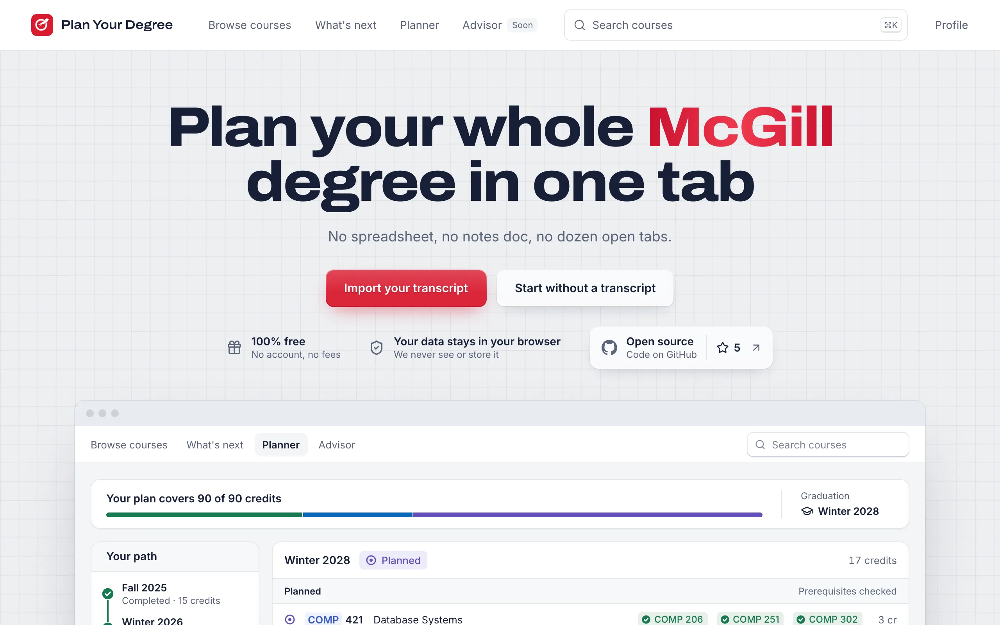
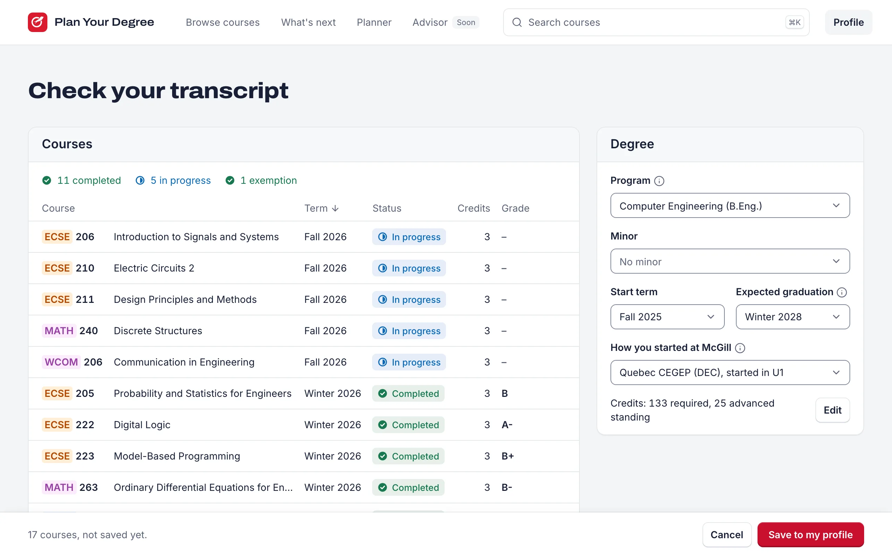
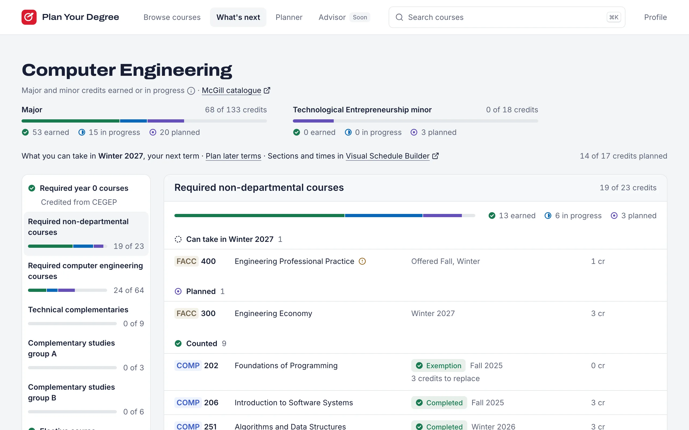
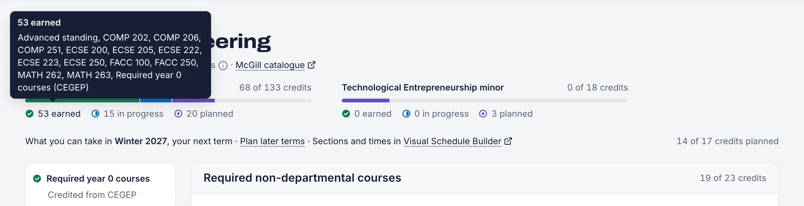
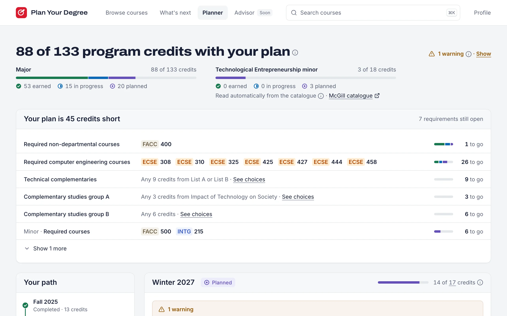
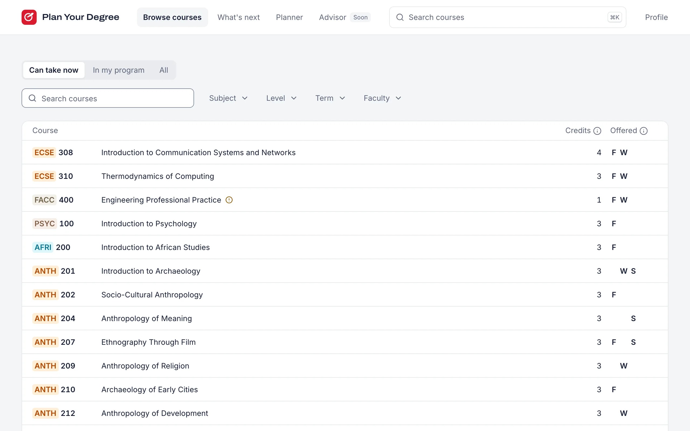
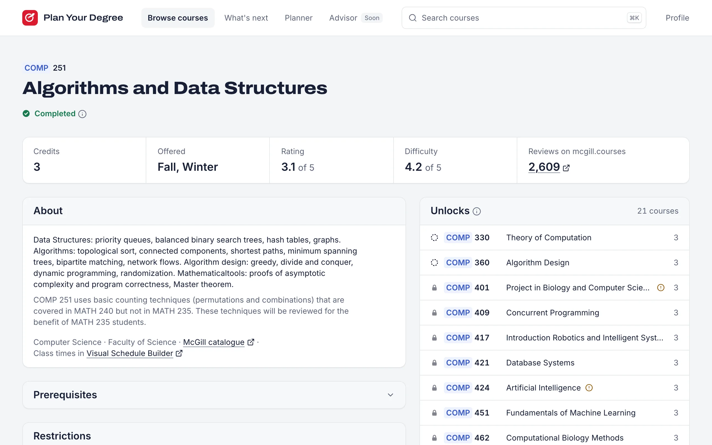
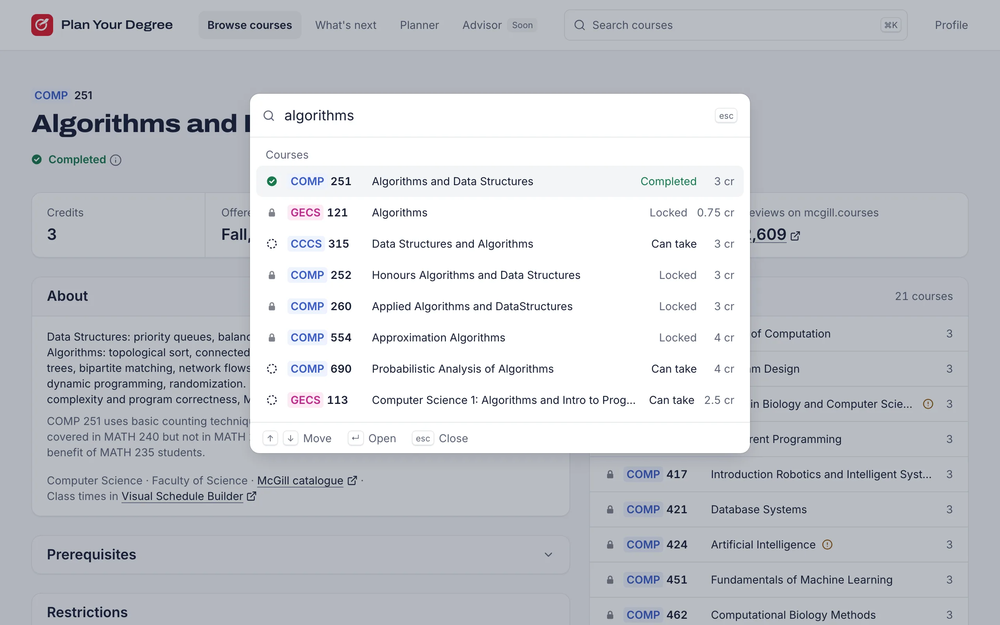
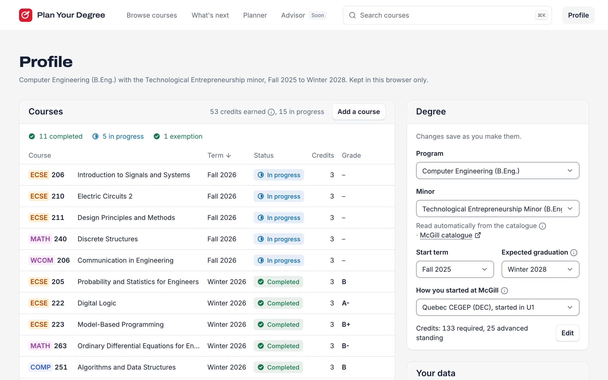
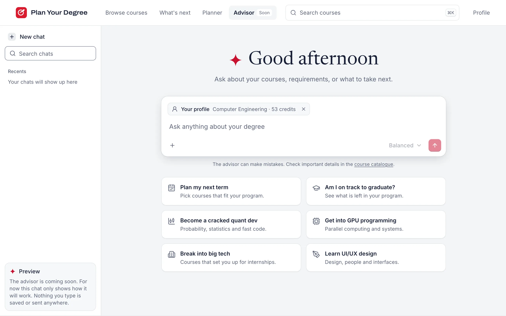

# McGill Plan Your Degree

Open-source degree planner for McGill students.
Import your unofficial transcript, see which courses you can take next, and plan every term up to graduation.
Plan Your Degree is not affiliated with McGill University.

Try it at [mcgill-plan-your-degree.vercel.app](https://mcgill-plan-your-degree.vercel.app).



## Features

The screenshots show a made-up student.

### Import your transcript

Drop in the unofficial transcript PDF from Minerva.
It is read in your browser, and you check every course, your program and your terms before anything is saved.
Quebec CEGEP students get Year 0 credited, Science DEC courses meet prerequisites, and advanced standing counts toward the degree.



### See what's next

See the courses you can take next term and the required ones you still need, requirement by requirement.
With a minor, its progress bar sits beside the major's.



Hover or tab to earned, in progress or planned on any bar to see the courses behind the number.



### Plan every term

Lay out each term until graduation, with warnings for missing prerequisites, terms a course is not offered, and credit overloads.
The plan lists what is still missing, and a minor counts the courses it shares with your major only up to the limit on its catalogue page.
Once a term's courses are set, pick their sections and times in McGill's [Visual Schedule Builder](https://vsb.mcgill.ca/criteria.jsp).



### Browse every course

Search and filter every McGill course by what you can take now, your program, subject, level, term and faculty.
Each course has a page with ratings from mcgill.courses, its prerequisites checked against your record, and what it unlocks.





### Search from anywhere

Press ⌘K, or Ctrl K, on any page to find a course or a page.



### Your profile

Keep your courses, program, minor and terms up to date, export a backup, or delete everything.
It all stays in this browser.



### Advisor, coming soon

A preview of the chat advisor, with starters for what students actually ask.



## Privacy

Everything stays in your browser.
The transcript is read on your device and is never uploaded, and the PDF is never stored.
The app has no accounts and no backend.
Course pages load public ratings from mcgill.courses, which receives only the course code, never profile data.
Export your data as a file or delete all of it from the profile page at any time.

## Setup

Requires Node 24 and pnpm 12.

```bash
nvm use
pnpm install
pnpm dev
```

Open http://localhost:3000.

## Scripts

| Command | What it does |
|---|---|
| `pnpm dev` | Start the dev server |
| `pnpm build` | Production build |
| `pnpm lint` | Lint and format check (Biome) |
| `pnpm format` | Fix lint and formatting |
| `pnpm typecheck` | Generate route types and run `tsc` |
| `pnpm test` | Unit tests (Vitest) |
| `pnpm test:e2e` | End-to-end tests (Playwright, desktop) |
| `pnpm crawl` | Crawl the course catalogue into `data/catalogue/` |
| `pnpm crawl:programs` | Crawl program requirements into `data/programs/generated/` |

Run `pnpm exec playwright install chromium` once before the first E2E run.

## Course catalogue

`pnpm crawl` reads every course page on [coursecatalogue.mcgill.ca](https://coursecatalogue.mcgill.ca/courses/) and writes one JSON file per subject to `data/catalogue/courses/`.
It sends at most 2 requests per second, follows robots.txt, and caches pages in `.cache/catalogue/` for a day, so an interrupted run resumes where it stopped.
A full crawl takes about 90 minutes.
The run fails instead of writing data when the course count drops more than 2% or more than 1% of courses lose a required field.
Prerequisites are parsed into AND/OR trees of course codes, and the raw text is always kept.
Text with conditions the tree cannot express, such as instructor permission, is marked `unparsed`.
Never edit files in `data/catalogue/` by hand.

`pnpm crawl:programs` reads every undergraduate program page and writes one file per program to `data/programs/generated/<catalogue year>/`, with an `index.json` listing them.
Each yearly crawl adds a folder and leaves earlier years alone.
Rules it cannot express safely, such as "9 credits selected from Groups A and B, with at least 3 from each", are kept as raw text and marked `unparsed`.
The summary lists the most common unparsed phrasings and compares the generated version of each hand-written program in `data/programs/` with the hand-written one.
Never edit files in `data/programs/generated/` by hand.

The `Crawl catalogue` GitHub Actions workflow runs both crawlers on demand and before each registration period.
When the data changed, it pushes a `data/crawl-*` branch and opens a PR with a summary of added, removed, and changed courses and the program crawl summary.
The CBC-Mcgill organization blocks Actions from opening PRs, so the run summary shows a one-click link to open it instead.
Catalogue data reaches production only by merging that PR.

## Contributing

Fixes and new programs are welcome.
Read [CONTRIBUTING.md](CONTRIBUTING.md) for the code rules, how to fix crawler bugs, and how to add a program.
The product spec is in [PRD.md](PRD.md).
For how the crawler, the data, the app and the transcript import fit together, read [ARCHITECTURE.md](ARCHITECTURE.md).

## License

MIT
