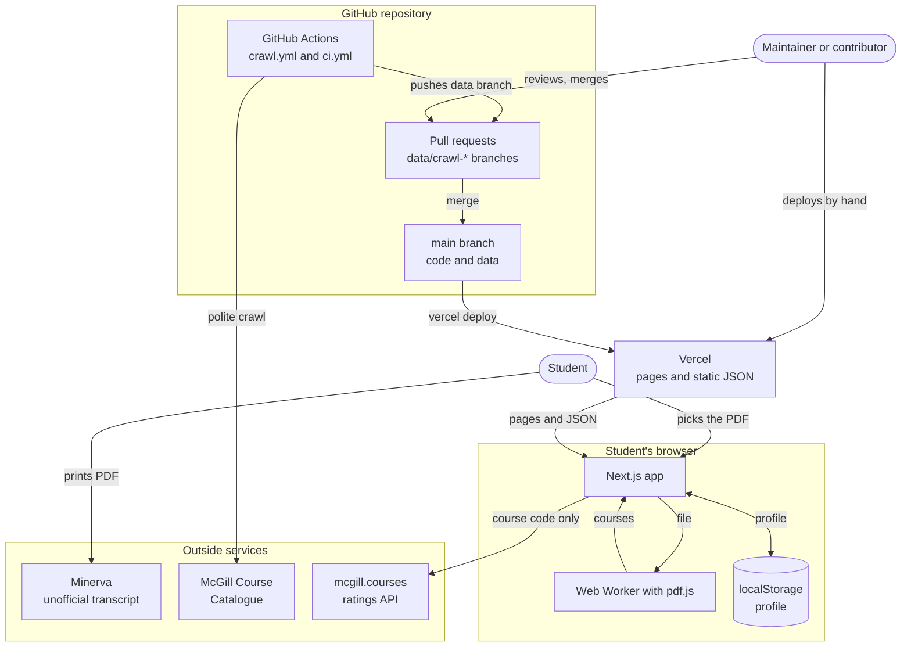
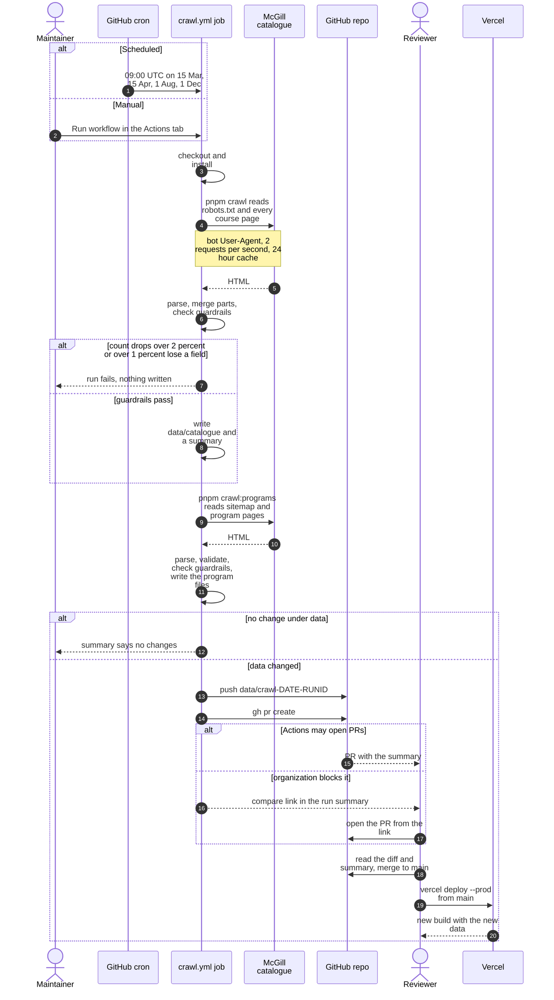
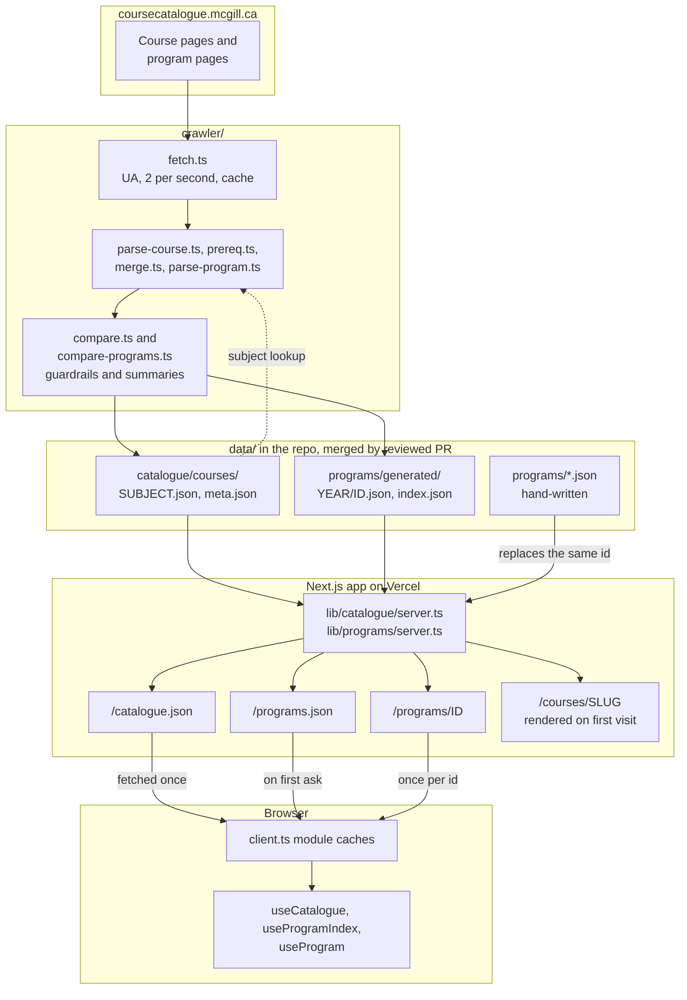
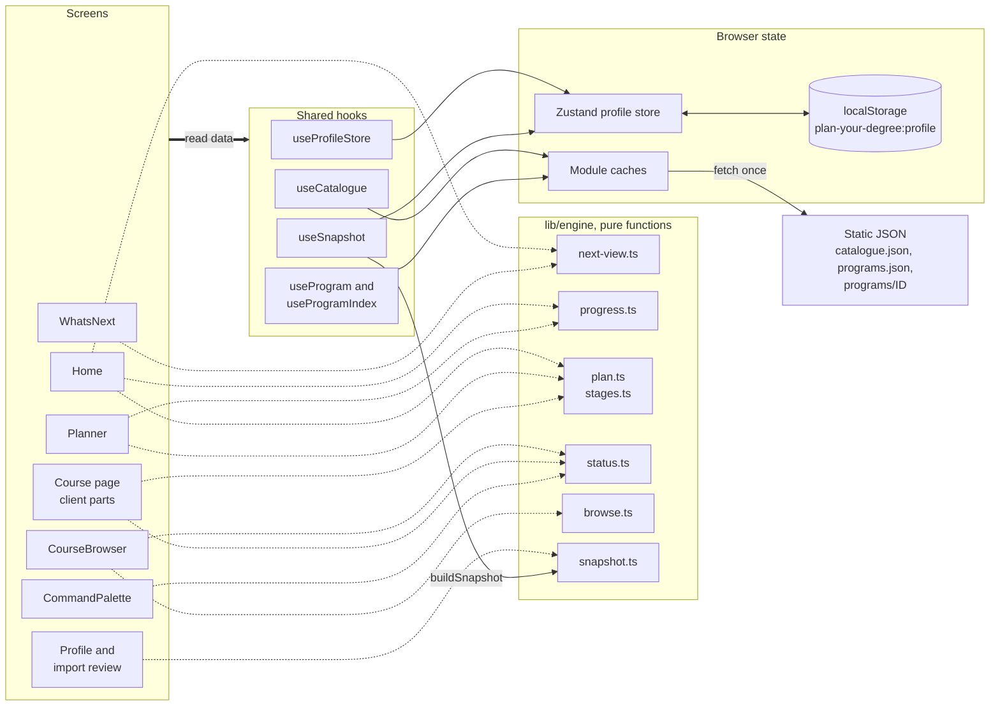
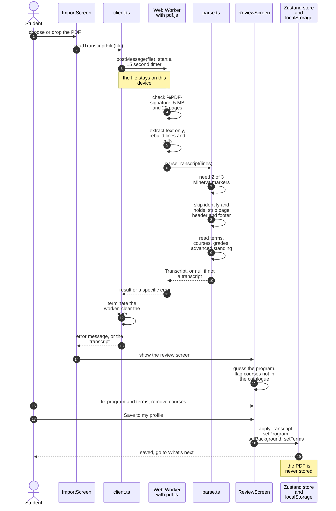
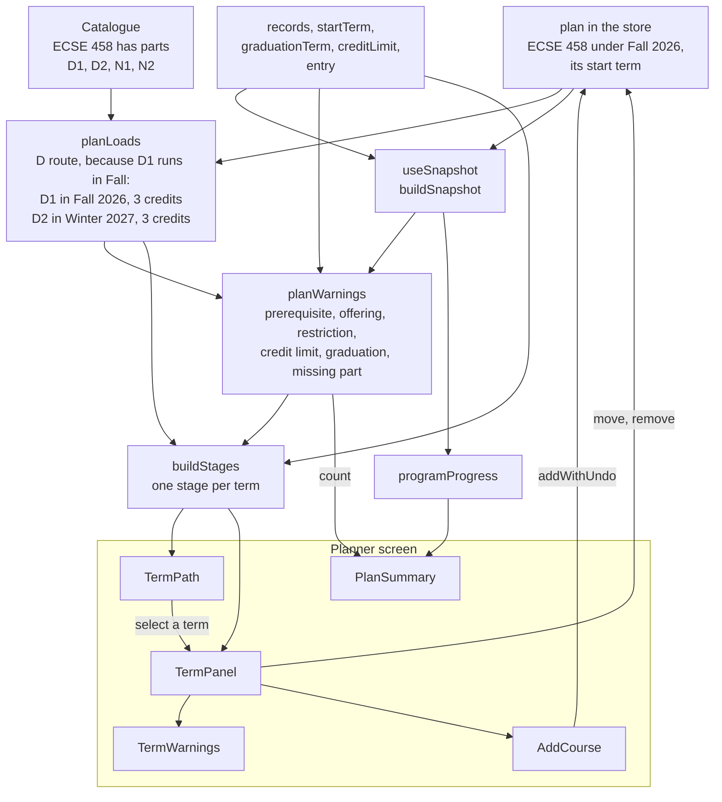
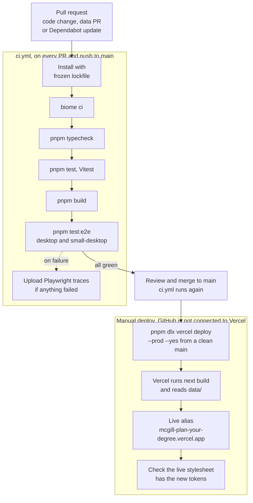

# Architecture diagrams

These diagrams show how Plan Your Degree fits together, from the outside services down to the planner.
Read [ARCHITECTURE.md](../ARCHITECTURE.md) for the full explanation, and [PRD.md](../PRD.md) for scope and requirements.

## System context

Who and what the project touches: people, McGill, mcgill.courses, GitHub, Vercel and the browser.

## The scheduled crawl job

What happens from the cron trigger or a manual run to a merged data PR and a live deploy.

## The data pipeline

How a catalogue page becomes JSON in the repo, then static routes, then a cache in the browser.

## The client runtime

Which layers the screens use, and where the profile and the catalogue live in the browser.

Every screen reads the profile through `useProfileStore`.
This table shows the rest.

| Screen | Hooks | Engine calls |
|---|---|---|
| Home | `useSnapshot`, `useCatalogue`, `useProgram` | `nextView`, `programProgress`, `buildStages` |
| WhatsNext | `useSnapshot`, `useCatalogue`, `useProgram` | `nextView` |
| Planner | `useSnapshot`, `useCatalogue`, `useProgram` | `planWarnings`, `buildStages`, `programProgress` |
| CourseBrowser | `useSnapshot`, `useCatalogue`, `useProgram` | `courseStatus`, `browse.ts` helpers |
| Course page, client parts | `useSnapshot` | `courseStatus`, `isOffered`, `courseLoads` |
| CommandPalette | `useSnapshot`, `useCatalogue` | `courseStatus` |
| Profile and import review | `useCatalogue`, `useProgram`, `useProgramIndex` | `buildSnapshot` |

## The transcript import

How a PDF becomes saved courses while the file stays on the student's device.

## The planner data flow

How a plan stored in start terms becomes loads, warnings, a term path and a term panel, with ECSE 458 as the example.

## CI and deployment

How a change goes from a pull request to the live site.

